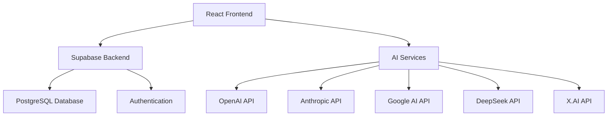

# 🚀 Multi-AI Chat Platform

<div align="center">


**A modern, open-source platform for chatting with multiple AI models simultaneously**

[🌟 Features](#features) • [🚀 Quick Start](#quick-start) • [📖 Documentation](#documentation) • [🤝 Contributing](#contributing)


</div>

## ✨ Features

### 🤖 **Multi-AI Integration**
- **5+ AI Models**: ChatGPT, Claude, Gemini, DeepSeek, Grok, and more
- **Simultaneous Responses**: Get answers from all models at once
- **Model Comparison**: Compare responses side-by-side
- **Custom API Keys**: Use your own API keys for each service

### 💬 **Advanced Chat Features**
- **Smart Chat Modes**: Multi-AI or Single-AI conversations
- **Persistent History**: All conversations saved securely
- **Real-time Responses**: Live typing indicators and smooth UX
- **Message Actions**: Copy, share, or start separate chats
- **Conversation Management**: Organize and search through chat history

### 🎨 **Modern UI/UX**
- **Responsive Design**: Perfect on desktop, tablet, and mobile
- **Dark Theme**: Easy on the eyes with beautiful gradients
- **Smooth Animations**: Professional micro-interactions
- **Intuitive Interface**: Clean, modern design inspired by top AI platforms

### 🔐 **Security & Privacy**
- **User Authentication**: Secure login with Supabase Auth
- **Data Encryption**: All messages encrypted at rest
- **API Key Management**: Securely store and manage API credentials
- **Row-Level Security**: Your data is completely private

### ⚡ **Performance**
- **Optimized Loading**: Fast initial load and smooth interactions
- **Efficient State Management**: React hooks and context for performance
- **Caching**: Smart caching for better user experience
- **Progressive Web App**: Install as a desktop/mobile app

## 🏗️ Architecture



## 🚀 Quick Start

### Prerequisites

- Node.js 18+ and npm
- A Supabase account (free tier available)
- API keys for desired AI models

### 1️⃣ Clone the Repository

```bash
git clone https://github.com/yourusername/multi-ai-platform.git
cd multi-ai-platform
```

### 2️⃣ Install Dependencies

```bash
npm install
```

### 3️⃣ Environment Setup

Create a `.env` file in the root directory:

```env
# Supabase Configuration
REACT_APP_SUPABASE_URL=your_supabase_project_url
REACT_APP_SUPABASE_ANON_KEY=your_supabase_anon_key

# Optional: Default API Keys (users can add their own)
REACT_APP_OPENAI_API_KEY=your_openai_key
REACT_APP_ANTHROPIC_API_KEY=your_anthropic_key
REACT_APP_GOOGLE_AI_API_KEY=your_google_key
REACT_APP_DEEPSEEK_API_KEY=your_deepseek_key
REACT_APP_XAI_API_KEY=your_xai_key
```

### 4️⃣ Database Setup

Run the SQL schema in your Supabase dashboard:

```sql
-- See /docs/database-schema.sql for complete setup
```

### 5️⃣ Start Development Server

```bash
npm start
```

Visit `http://localhost:3000` to see the app in action! 🎉

## 📖 Documentation

### 🔧 Configuration

#### Supported AI Models

| Model | Provider | Status | API Documentation |
|-------|----------|--------|------------------|
| GPT-4 | OpenAI | ✅ Active | [OpenAI Docs](https://platform.openai.com/docs) |
| Claude | Anthropic | ✅ Active | [Anthropic Docs](https://docs.anthropic.com) |
| Gemini | Google | ✅ Active | [Google AI Docs](https://ai.google.dev/docs) |
| DeepSeek | DeepSeek | ✅ Active | [DeepSeek Docs](https://platform.deepseek.com/docs) |
| Grok | X.AI | ✅ Active | [X.AI Docs](https://docs.x.ai) |

#### Chat Modes

- **Multi-AI Mode**: Send your message to all enabled AI models simultaneously
- **Single-AI Mode**: Chat with one specific AI model
- **Comparison Mode**: Switch between models within the same conversation

### 🛠️ Development

#### Project Structure

```
src/
├── components/          # React components
│   ├── Auth/           # Authentication components
│   ├── Chat/           # Chat-related components
│   ├── Layout/         # Layout components
│   └── Settings/       # Settings components
├── services/           # API services
├── hooks/             # Custom React hooks
├── contexts/          # React contexts
└── utils/            # Utility functions
```

#### Adding New AI Models

1. Update `src/utils/constants.js` with model configuration
2. Add API service in `src/services/aiService.js`
3. Update UI components to include the new model

#### Custom Hooks

- `useAuth()` - Authentication state management
- `useChat()` - Chat functionality
- `useSettings()` - User settings and preferences

## 🎯 Roadmap

- [ ] **Voice Chat**: Voice input and output for conversations
- [ ] **File Uploads**: Share documents and images with AI models
- [ ] **Custom Prompts**: Save and reuse custom prompt templates
- [ ] **Team Collaboration**: Share conversations with team members
- [ ] **Analytics Dashboard**: Usage statistics and insights
- [ ] **Mobile App**: Native iOS and Android applications
- [ ] **API Access**: RESTful API for third-party integrations
- [ ] **Plugin System**: Extend functionality with custom plugins

## 🤝 Contributing

We love contributions! Here's how you can help:

### 🐛 Bug Reports
- Use the [issue tracker](https://github.com/yourusername/multi-ai-platform/issues)
- Include steps to reproduce
- Add screenshots if applicable

### 💡 Feature Requests
- Check existing [feature requests](https://github.com/yourusername/multi-ai-platform/labels/enhancement)
- Describe the use case and expected behavior
- Add mockups or examples if helpful

### 🛠️ Development

1. Fork the repository
2. Create a feature branch: `git checkout -b feature/amazing-feature`
3. Commit changes: `git commit -m 'Add amazing feature'`
4. Push to branch: `git push origin feature/amazing-feature`
5. Open a Pull Request

## 📊 Stats


## 💡 Use Cases

### 👨‍💼 **Business Users**
- Compare AI responses for important decisions
- Get diverse perspectives on complex problems
- Streamline research and analysis workflows

### 👩‍💻 **Developers**
- Test different AI models for integration
- Compare code generation capabilities
- Prototype AI-powered features

### 🎓 **Students & Researchers**
- Academic research and homework assistance
- Compare AI reasoning approaches
- Learning and educational support

### ✍️ **Content Creators**
- Generate diverse creative content
- Compare writing styles and approaches
- Brainstorm ideas across multiple AI perspectives

## 🔒 Privacy & Security

- **Local Storage**: API keys stored locally in your browser
- **Encrypted Communication**: All data transmitted over HTTPS
- **No Data Retention**: We don't store your conversation content
- **Open Source**: Full transparency - audit the code yourself
- **GDPR Compliant**: Respects user privacy and data protection

## 📄 License

This project is licensed under the MIT License - see the [LICENSE](LICENSE) file for details.

## 🙏 Acknowledgments

- [OpenAI](https://openai.com) for GPT models
- [Anthropic](https://anthropic.com) for Claude
- [Google](https://ai.google.dev) for Gemini
- [DeepSeek](https://deepseek.com) for DeepSeek models
- [X.AI](https://x.ai) for Grok
- [Supabase](https://supabase.com) for backend infrastructure
- [Tailwind CSS](https://tailwindcss.com) for styling
- [Lucide](https://lucide.dev) for icons

## 🌟 Star History

[](https://star-history.com/#yourusername/multi-ai-platform&Date)

---

<div align="center">

**Made with ❤️ for the AI community**

[⭐ Star this repo](https://github.com/yourusername/multi-ai-platform) • [🐦 Follow on Twitter](https://twitter.com/yourusername) • [💬 Join Discord](https://discord.gg/your-invite)

</div>
